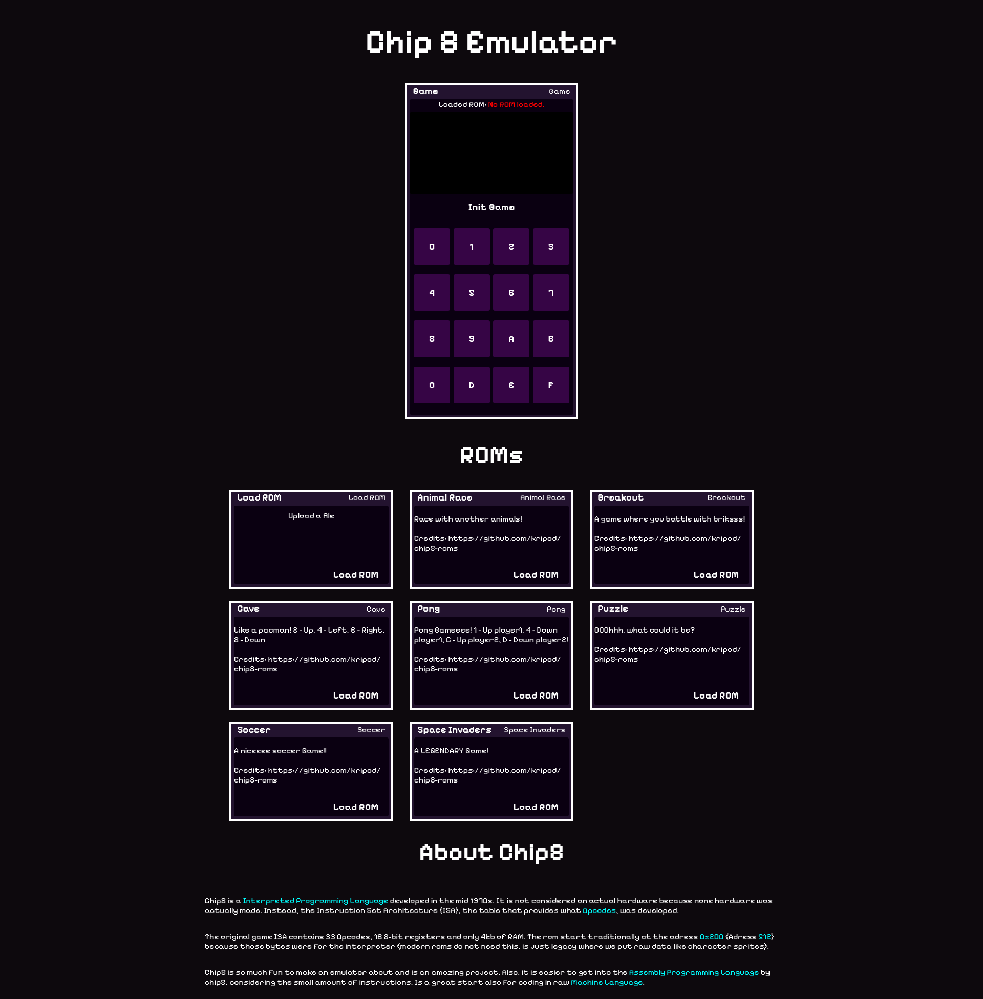

# Chip8Emulator

A simple but smooth CHIP 8 emulator

## EPILEPSY WARNING:
Chip-8 uses a bit flip logic. As the old hardware couldn't handle soft-movements, it flickers with a fast movement, making flashing lights.

## How to use
1. Load or upload a ROM by pressing the button below the card 'LOAD ROM'.
2. Initialize the ROM by pressing the button below the canvas
3. Play the game bby using the virtual keyboard or the physical one! (Keymap: 1234qwertasdfzxcv = 4x4 square on QWERTY keyboards)

## Features
- Sound emulating
- Code interpreting
- ROM loading
- Default built-in ROMs

## Technologies
- Javascript
- HTML
- CSS
- Vue
- Vite

## What it taught me
This project taught me a lot about emulators, CPU's fetch-decode-execute cycle and how computer architectures work. It is amazing to see something that you built running other people code. I also learned a LOT of vue styling and how to structure a entire project, separete the logic into folders, wrap the classes and so more.
I also learned about wait with calmness. Building an emulator is Blazzingly Hard Since you develop for hours being completely blind, since a lot of the hardware needs to be emulated to see something work.

## AI usage declaration
Minimal AI was used at this project. I used to help in one line of css and find a bug at after 40m stuck and other minimal things, such understanding why vue worked at that way etc. More detailed declaration can be found at my stardance project page: https://stardance.hackclub.com/projects/33236